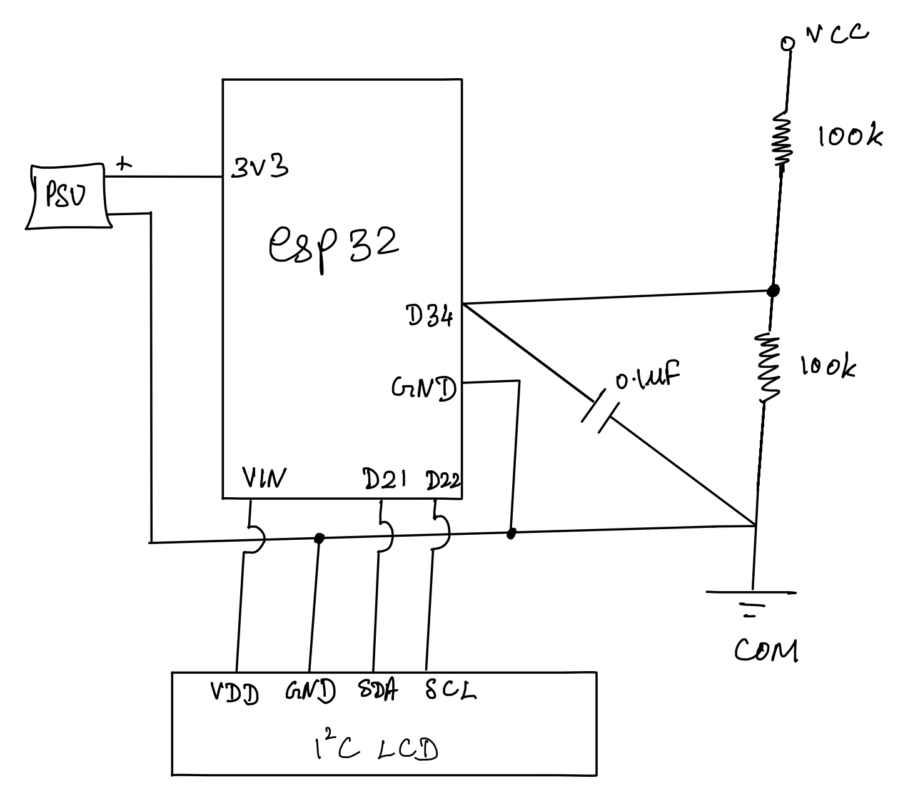

# 🔋 ESP32 Battery Monitoring Module

## 📌 Overview

This project implements a battery monitoring system using the ESP32 to measure, estimate, and display the charge level of a Lithium-ion (18650) battery.

The system reads battery voltage through a voltage divider, processes it using the ESP32 ADC, converts it into a realistic battery percentage using a non-linear model, and displays the result on an I2C LCD with a visual battery bar.

---

## 🎯 Objectives

- Safely measure Li-ion battery voltage using ESP32 ADC
- Convert voltage into a realistic battery percentage
- Display battery status on an I2C LCD
- Provide serial output for debugging and calibration
- Ensure stable, non-blocking system operation

---

## ⚙️ Hardware Components

- ESP32
- 18650 Li-ion Battery
- 2 × 100kΩ Resistors (Voltage Divider)
- 0.1µF Capacitor (Noise Filtering)
- 16x2 LCD with I2C Backpack
- Breadboard & Connecting Wires

---

## 🔌 Circuit Diagram



### Key Points:

- Voltage divider scales battery voltage (4.2V → ~2.1V max)
- ADC input remains within safe ESP32 limits (≤ 3.3V)
- Capacitor reduces ADC noise
- Common ground is shared across all components

---

## 🧠 System Architecture

Battery → Voltage Divider → ESP32 ADC → Processing → LCD + Serial Output

---

## 📊 Battery Percentage Estimation

Lithium-ion batteries do not discharge linearly.
A piecewise approximation model is used to estimate charge level:

| Voltage | Approx % |
| ------- | -------- |
| 4.2V    | 100%     |
| 3.7V    | ~50%     |
| 3.3V    | ~10%     |
| 3.0V    | 0%       |

Intermediate values are interpolated for smoother estimation.

---

## ⚙️ Software Design

### Features

- **ADC Averaging** for stable readings
- **Calibration Support** (adjustable reference voltage)
- **Non-blocking Timing** using `millis()`
- **Custom LCD UI** with battery bar visualization
- **Low Battery Warning System**

---

## 🔄 Workflow

1. Read ADC values (multiple samples)
2. Average readings for noise reduction
3. Convert ADC → Voltage
4. Apply voltage divider scaling
5. Map voltage → battery percentage
6. Display results on LCD and Serial

---

## 🧪 Calibration

The ESP32 ADC is not perfectly linear and requires calibration.

### Method:

1. Measure battery voltage using a multimeter
2. Compare with ESP32 readings
3. Adjust reference voltage constant

```cpp
const float ADC_REF_VOLTAGE = 3.35; // calibrated value
```

---

## 📟 Display Output

Example:

```
[███████   ] 78%
V: 3.92V
```

- Top line: Battery bar + percentage
- Bottom line: Voltage

---

## ⚠️ Challenges Faced

### ADC Inaccuracy

- ESP32 ADC is non-linear
- Required calibration and averaging

### Noisy Readings

- Stabilized using capacitor + averaging

### LCD Visibility Issue

- Poor contrast initially
- Fixed using potentiometer adjustment

### Timing Issues

- Replaced blocking `delay()` with `millis()`

---

## 🚀 Features

- Real-time voltage monitoring
- Battery percentage estimation
- LCD display with battery bar
- Serial debugging output
- Low battery alert

---

## 📈 Future Improvements

- Use external ADC (ADS1115) for higher accuracy
- Add WiFi (MQTT/HTTP) for remote monitoring
- Log battery data over time
- RTOS-based multi-tasking
- Charging detection

---

## 🧠 Key Learnings

- Practical limitations of ADC in embedded systems
- Importance of calibration in real-world systems
- Designing non-blocking embedded applications
- Hardware-software debugging workflow
- UI design under embedded constraints

---

## 📌 Conclusion

This project demonstrates a complete embedded system pipeline — from analog signal acquisition to user interface — while addressing real-world challenges such as noise, calibration, and system timing.

---

## 👨‍💻 Author

Aditya Raman

# 🔋 ESP32 Battery Monitoring Module

## 📌 Overview

This project implements a battery monitoring system using the ESP32 to measure, estimate, and display the charge level of a Lithium-ion (18650) battery.

The system reads battery voltage through a voltage divider, processes it using the ESP32 ADC, converts it into a realistic battery percentage using a non-linear model, and displays the result on an I2C LCD with a visual battery bar.

---

## 🎯 Objectives

- Safely measure Li-ion battery voltage using ESP32 ADC
- Convert voltage into a realistic battery percentage
- Display battery status on an I2C LCD
- Provide serial output for debugging and calibration
- Ensure stable, non-blocking system operation

---

## ⚙️ Hardware Components

- ESP32
- 18650 Li-ion Battery
- 2 × 100kΩ Resistors (Voltage Divider)
- 0.1µF Capacitor (Noise Filtering)
- 16x2 LCD with I2C Backpack
- Breadboard & Connecting Wires

---

## 🔌 Circuit Diagram


### Key Points:

- Voltage divider scales battery voltage (4.2V → ~2.1V max)
- ADC input remains within safe ESP32 limits (≤ 3.3V)
- Capacitor reduces ADC noise
- Common ground is shared across all components

---

## 🧠 System Architecture

Battery → Voltage Divider → ESP32 ADC → Processing → LCD + Serial Output

---

## 📊 Battery Percentage Estimation

Lithium-ion batteries do not discharge linearly.
A piecewise approximation model is used to estimate charge level:

| Voltage | Approx % |
| ------- | -------- |
| 4.2V    | 100%     |
| 3.7V    | ~50%     |
| 3.3V    | ~10%     |
| 3.0V    | 0%       |

Intermediate values are interpolated for smoother estimation.

---

## ⚙️ Software Design

### Features

- **ADC Averaging** for stable readings
- **Calibration Support** (adjustable reference voltage)
- **Non-blocking Timing** using `millis()`
- **Custom LCD UI** with battery bar visualization
- **Low Battery Warning System**

---

## 🔄 Workflow

1. Read ADC values (multiple samples)
2. Average readings for noise reduction
3. Convert ADC → Voltage
4. Apply voltage divider scaling
5. Map voltage → battery percentage
6. Display results on LCD and Serial

---

## 🧪 Calibration

The ESP32 ADC is not perfectly linear and requires calibration.

### Method:

1. Measure battery voltage using a multimeter
2. Compare with ESP32 readings
3. Adjust reference voltage constant

```cpp
const float ADC_REF_VOLTAGE = 3.35; // calibrated value
```

---

## 📟 Display Output

Example:

```
[███████   ] 78%
V: 3.92V
```

- Top line: Battery bar + percentage
- Bottom line: Voltage

---

## ⚠️ Challenges Faced

### ADC Inaccuracy

- ESP32 ADC is non-linear
- Required calibration and averaging

### Noisy Readings

- Stabilized using capacitor + averaging

### LCD Visibility Issue

- Poor contrast initially
- Fixed using potentiometer adjustment

### Timing Issues

- Replaced blocking `delay()` with `millis()`

---

## 🚀 Features

- Real-time voltage monitoring
- Battery percentage estimation
- LCD display with battery bar
- Serial debugging output
- Low battery alert

---

## 📈 Future Improvements

- Use external ADC (ADS1115) for higher accuracy
- Add WiFi (MQTT/HTTP) for remote monitoring
- Log battery data over time
- RTOS-based multi-tasking
- Charging detection

---

## 🧠 Key Learnings

- Practical limitations of ADC in embedded systems
- Importance of calibration in real-world systems
- Designing non-blocking embedded applications
- Hardware-software debugging workflow
- UI design under embedded constraints

---

## 📌 Conclusion

This project demonstrates a complete embedded system pipeline — from analog signal acquisition to user interface — while addressing real-world challenges such as noise, calibration, and system timing.

---

## 👨‍💻 Author

Aditya Raman
